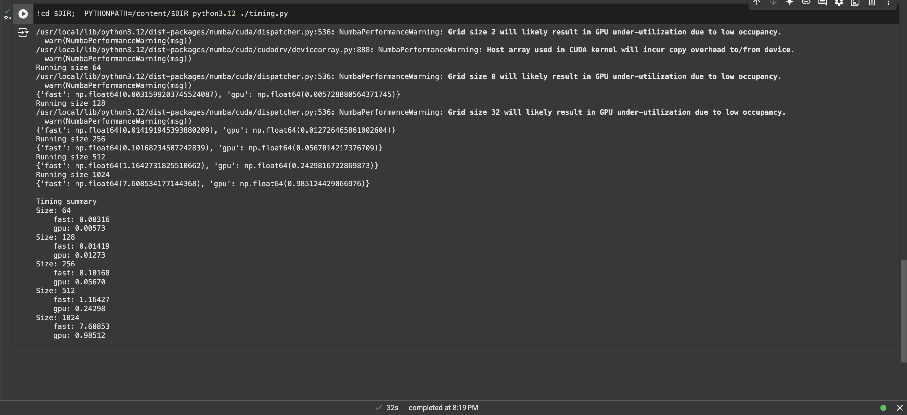
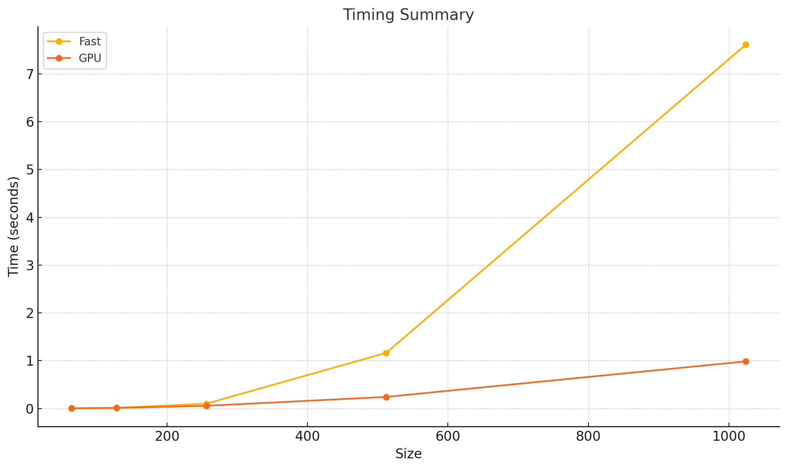

# MiniTorch Module 3


* Docs: https://minitorch.github.io/

* Overview: https://minitorch.github.io/module3.html


You will need to modify `tensor_functions.py` slightly in this assignment.

* Tests:

```
python run_tests.py
```

* Note:

Several of the tests for this assignment will only run if you are on a GPU machine and will not
run on github's test infrastructure. Please follow the instructions to setup up a colab machine
to run these tests.

This assignment requires the following files from the previous assignments. You can get these by running

```bash
python sync_previous_module.py previous-module-dir current-module-dir
```

The files that will be synced are:

        minitorch/tensor_data.py minitorch/tensor_functions.py minitorch/tensor_ops.py minitorch/operators.py minitorch/scalar.py minitorch/scalar_functions.py minitorch/module.py minitorch/autodiff.py minitorch/module.py project/run_manual.py project/run_scalar.py project/run_tensor.py minitorch/operators.py minitorch/module.py minitorch/autodiff.py minitorch/tensor.py minitorch/datasets.py minitorch/testing.py minitorch/optim.py
## Task 3.1

```bash
MAP
OMP: Info #276: omp_set_nested routine deprecated, please use omp_set_max_active_levels instead.
 
================================================================================
 Parallel Accelerator Optimizing:  Function tensor_map.<locals>._map, 
/Users/reitwiec/Desktop/Cornell/MLE/mod3-reitwiec/minitorch/fast_ops.py (163)  
================================================================================


Parallel loop listing for  Function tensor_map.<locals>._map, /Users/reitwiec/Desktop/Cornell/MLE/mod3-reitwiec/minitorch/fast_ops.py (163) 
-----------------------------------------------------------------------------------------------------------------------------------------|loop #ID
    def _map(                                                                                                                            | 
        out: Storage,                                                                                                                    | 
        out_shape: Shape,                                                                                                                | 
        out_strides: Strides,                                                                                                            | 
        in_storage: Storage,                                                                                                             | 
        in_shape: Shape,                                                                                                                 | 
        in_strides: Strides,                                                                                                             | 
    ) -> None:                                                                                                                           | 
        # TODO: Implement for Task 3.1.                                                                                                  | 
        direct_mapping = len(out_strides) != len(in_strides) or (out_strides != in_strides).any() or (out_shape != in_shape).any()-------| #0, 1
        if direct_mapping:                                                                                                               | 
            for i in prange(len(out)):---------------------------------------------------------------------------------------------------| #3
                out_idx = np.empty(MAX_DIMS, np.int32)                                                                                   | 
                in_idx = np.empty(MAX_DIMS, np.int32)                                                                                    | 
                # compute multidimensional indices                                                                                       | 
                to_index(i, out_shape, out_idx)                                                                                          | 
                broadcast_index(out_idx, out_shape, in_shape, in_idx)                                                                    | 
                out_posn = index_to_position(out_idx, out_strides)                                                                       | 
                in_posn = index_to_position(in_idx, in_strides)                                                                          | 
                out[out_posn] = fn(in_storage[in_posn])                                                                                  | 
            return                                                                                                                       | 
        for i in prange(len(out)):-------------------------------------------------------------------------------------------------------| #2
            out[i] = fn(in_storage[i])                                                                                                   | 
--------------------------------- Fusing loops ---------------------------------
Attempting fusion of parallel loops (combines loops with similar properties)...
Following the attempted fusion of parallel for-loops there are 4 parallel for-
loop(s) (originating from loops labelled: #0, #1, #3, #2).
--------------------------------------------------------------------------------
----------------------------- Before Optimisation ------------------------------
--------------------------------------------------------------------------------
------------------------------ After Optimisation ------------------------------
Parallel structure is already optimal.
--------------------------------------------------------------------------------
--------------------------------------------------------------------------------
 
---------------------------Loop invariant code motion---------------------------
Allocation hoisting:
The memory allocation derived from the instruction at 
/Users/reitwiec/Desktop/Cornell/MLE/mod3-reitwiec/minitorch/fast_ops.py (175) is
 hoisted out of the parallel loop labelled #3 (it will be performed before the 
loop is executed and reused inside the loop):
   Allocation:: out_idx = np.empty(MAX_DIMS, np.int32)
    - numpy.empty() is used for the allocation.
The memory allocation derived from the instruction at 
/Users/reitwiec/Desktop/Cornell/MLE/mod3-reitwiec/minitorch/fast_ops.py (176) is
 hoisted out of the parallel loop labelled #3 (it will be performed before the 
loop is executed and reused inside the loop):
   Allocation:: in_idx = np.empty(MAX_DIMS, np.int32)
    - numpy.empty() is used for the allocation.
None
ZIP
 
================================================================================
 Parallel Accelerator Optimizing:  Function tensor_zip.<locals>._zip, 
/Users/reitwiec/Desktop/Cornell/MLE/mod3-reitwiec/minitorch/fast_ops.py (213)  
================================================================================


Parallel loop listing for  Function tensor_zip.<locals>._zip, /Users/reitwiec/Desktop/Cornell/MLE/mod3-reitwiec/minitorch/fast_ops.py (213) 
--------------------------------------------------------------------------------------------------------------------------------------------------------------------------------------------------------------------------------------------------------|loop #ID
    def _zip(                                                                                                                                                                                                                                           | 
        out: Storage,                                                                                                                                                                                                                                   | 
        out_shape: Shape,                                                                                                                                                                                                                               | 
        out_strides: Strides,                                                                                                                                                                                                                           | 
        a_storage: Storage,                                                                                                                                                                                                                             | 
        a_shape: Shape,                                                                                                                                                                                                                                 | 
        a_strides: Strides,                                                                                                                                                                                                                             | 
        b_storage: Storage,                                                                                                                                                                                                                             | 
        b_shape: Shape,                                                                                                                                                                                                                                 | 
        b_strides: Strides,                                                                                                                                                                                                                             | 
    ) -> None:                                                                                                                                                                                                                                          | 
        # TODO: Implement for Task 3.1.                                                                                                                                                                                                                 | 
        direct_mapping = (len(out_strides) != len(a_strides) or len(out_strides) != len(b_strides) or (out_strides != a_strides).any() or (out_strides != b_strides).any() or (out_shape != a_shape).any() or (out_shape != b_shape).any())-------------| #4, 5, 6, 7
        if direct_mapping:                                                                                                                                                                                                                              | 
            for i in prange(len(out)):------------------------------------------------------------------------------------------------------------------------------------------------------------------------------------------------------------------| #9
                out_idx = np.empty(MAX_DIMS, np.int32)                                                                                                                                                                                                  | 
                a_idx = np.empty(MAX_DIMS, np.int32)                                                                                                                                                                                                    | 
                b_idx = np.empty(MAX_DIMS, np.int32)                                                                                                                                                                                                    | 
                to_index(i, out_shape, out_idx)                                                                                                                                                                                                         | 
                broadcast_index(out_idx, out_shape, a_shape, a_idx)                                                                                                                                                                                     | 
                broadcast_index(out_idx, out_shape, b_shape, b_idx)                                                                                                                                                                                     | 
                a_posn = index_to_position(a_idx, a_strides)                                                                                                                                                                                            | 
                b_posn = index_to_position(b_idx, b_strides)                                                                                                                                                                                            | 
                a_data = a_storage[a_posn]                                                                                                                                                                                                              | 
                b_data = b_storage[b_posn]                                                                                                                                                                                                              | 
                out_posn = index_to_position(out_idx, out_strides)                                                                                                                                                                                      | 
                out[out_posn] = fn(a_data, b_data)                                                                                                                                                                                                      | 
            return                                                                                                                                                                                                                                      | 
        for i in prange(len(out)):----------------------------------------------------------------------------------------------------------------------------------------------------------------------------------------------------------------------| #8
            out[i] = fn(a_storage[i], b_storage[i])                                                                                                                                                                                                     | 
--------------------------------- Fusing loops ---------------------------------
Attempting fusion of parallel loops (combines loops with similar properties)...
Following the attempted fusion of parallel for-loops there are 6 parallel for-
loop(s) (originating from loops labelled: #4, #5, #6, #7, #9, #8).
--------------------------------------------------------------------------------
----------------------------- Before Optimisation ------------------------------
--------------------------------------------------------------------------------
------------------------------ After Optimisation ------------------------------
Parallel structure is already optimal.
--------------------------------------------------------------------------------
--------------------------------------------------------------------------------
 
---------------------------Loop invariant code motion---------------------------
Allocation hoisting:
The memory allocation derived from the instruction at 
/Users/reitwiec/Desktop/Cornell/MLE/mod3-reitwiec/minitorch/fast_ops.py (228) is
 hoisted out of the parallel loop labelled #9 (it will be performed before the 
loop is executed and reused inside the loop):
   Allocation:: out_idx = np.empty(MAX_DIMS, np.int32)
    - numpy.empty() is used for the allocation.
The memory allocation derived from the instruction at 
/Users/reitwiec/Desktop/Cornell/MLE/mod3-reitwiec/minitorch/fast_ops.py (229) is
 hoisted out of the parallel loop labelled #9 (it will be performed before the 
loop is executed and reused inside the loop):
   Allocation:: a_idx = np.empty(MAX_DIMS, np.int32)
    - numpy.empty() is used for the allocation.
The memory allocation derived from the instruction at 
/Users/reitwiec/Desktop/Cornell/MLE/mod3-reitwiec/minitorch/fast_ops.py (230) is
 hoisted out of the parallel loop labelled #9 (it will be performed before the 
loop is executed and reused inside the loop):
   Allocation:: b_idx = np.empty(MAX_DIMS, np.int32)
    - numpy.empty() is used for the allocation.
None
REDUCE
 
================================================================================
 Parallel Accelerator Optimizing:  Function tensor_reduce.<locals>._reduce, 
/Users/reitwiec/Desktop/Cornell/MLE/mod3-reitwiec/minitorch/fast_ops.py (268)  
================================================================================


Parallel loop listing for  Function tensor_reduce.<locals>._reduce, /Users/reitwiec/Desktop/Cornell/MLE/mod3-reitwiec/minitorch/fast_ops.py (268) 
--------------------------------------------------------------------|loop #ID
    def _reduce(                                                    | 
        out: Storage,                                               | 
        out_shape: Shape,                                           | 
        out_strides: Strides,                                       | 
        a_storage: Storage,                                         | 
        a_shape: Shape,                                             | 
        a_strides: Strides,                                         | 
        reduce_dim: int,                                            | 
    ) -> None:                                                      | 
        # TODO: Implement for Task 3.1.                             | 
        for i in prange(len(out)):----------------------------------| #10
            out_index = np.empty(MAX_DIMS, np.int32)                | 
            dim = a_shape[reduce_dim]                               | 
            to_index(i, out_shape, out_index)                       | 
            out_posn = index_to_position(out_index, out_strides)    | 
            accum = out[out_posn]                                   | 
            posn = index_to_position(out_index, a_strides)          | 
            ast = a_strides[reduce_dim]                             | 
            for step in range(dim):                                 | 
                accum = fn(accum, a_storage[posn])                  | 
                posn += ast                                         | 
            out[out_posn] = accum                                   | 
--------------------------------- Fusing loops ---------------------------------
Attempting fusion of parallel loops (combines loops with similar properties)...
Following the attempted fusion of parallel for-loops there are 1 parallel for-
loop(s) (originating from loops labelled: #10).
--------------------------------------------------------------------------------
----------------------------- Before Optimisation ------------------------------
--------------------------------------------------------------------------------
------------------------------ After Optimisation ------------------------------
Parallel structure is already optimal.
--------------------------------------------------------------------------------
--------------------------------------------------------------------------------
 
---------------------------Loop invariant code motion---------------------------
Allocation hoisting:
The memory allocation derived from the instruction at 
/Users/reitwiec/Desktop/Cornell/MLE/mod3-reitwiec/minitorch/fast_ops.py (279) is
 hoisted out of the parallel loop labelled #10 (it will be performed before the 
loop is executed and reused inside the loop):
   Allocation:: out_index = np.empty(MAX_DIMS, np.int32)
    - numpy.empty() is used for the allocation.
None
MATRIX MULTIPLY
 
================================================================================
 Parallel Accelerator Optimizing:  Function _tensor_matrix_multiply, 
/Users/reitwiec/Desktop/Cornell/MLE/mod3-reitwiec/minitorch/fast_ops.py (294)  
================================================================================


Parallel loop listing for  Function _tensor_matrix_multiply, /Users/reitwiec/Desktop/Cornell/MLE/mod3-reitwiec/minitorch/fast_ops.py (294) 
----------------------------------------------------------------------------------------------------------|loop #ID
def _tensor_matrix_multiply(                                                                              | 
    out: Storage,                                                                                         | 
    out_shape: Shape,                                                                                     | 
    out_strides: Strides,                                                                                 | 
    a_storage: Storage,                                                                                   | 
    a_shape: Shape,                                                                                       | 
    a_strides: Strides,                                                                                   | 
    b_storage: Storage,                                                                                   | 
    b_shape: Shape,                                                                                       | 
    b_strides: Strides,                                                                                   | 
) -> None:                                                                                                | 
    """NUMBA tensor matrix multiply function.                                                             | 
                                                                                                          | 
    Should work for any tensor shapes that broadcast as long as                                           | 
                                                                                                          | 
    ```                                                                                                   | 
    assert a_shape[-1] == b_shape[-2]                                                                     | 
    ```                                                                                                   | 
                                                                                                          | 
    Optimizations:                                                                                        | 
                                                                                                          | 
    * Outer loop in parallel                                                                              | 
    * No index buffers or function calls                                                                  | 
    * Inner loop should have no global writes, 1 multiply.                                                | 
                                                                                                          | 
                                                                                                          | 
    Args:                                                                                                 | 
    ----                                                                                                  | 
        out (Storage): storage for `out` tensor                                                           | 
        out_shape (Shape): shape for `out` tensor                                                         | 
        out_strides (Strides): strides for `out` tensor                                                   | 
        a_storage (Storage): storage for `a` tensor                                                       | 
        a_shape (Shape): shape for `a` tensor                                                             | 
        a_strides (Strides): strides for `a` tensor                                                       | 
        b_storage (Storage): storage for `b` tensor                                                       | 
        b_shape (Shape): shape for `b` tensor                                                             | 
        b_strides (Strides): strides for `b` tensor                                                       | 
                                                                                                          | 
    Returns:                                                                                              | 
    -------                                                                                               | 
        None : Fills in `out`                                                                             | 
                                                                                                          | 
    """                                                                                                   | 
    # strides for broadcasting in batch dimensions.                                                       | 
    a_batch_stride = a_strides[0] if a_shape[0] > 1 else 0                                                | 
    b_batch_stride = b_strides[0] if b_shape[0] > 1 else 0                                                | 
                                                                                                          | 
    # TODO: Implement for Task 3.2.                                                                       | 
    # outer loop over the batch dimension of the output.                                                  | 
    for batch_idx in prange(out_shape[0]):----------------------------------------------------------------| #13
        for row_idx in prange(out_shape[1]):--------------------------------------------------------------| #12
            for col_idx in prange(out_shape[2]):----------------------------------------------------------| #11
                # calculate initial positions in A and B for the current batch and row/column indices.    | 
                a_pos = batch_idx * a_batch_stride + row_idx * a_strides[1]                               | 
                b_pos = batch_idx * b_batch_stride + col_idx * b_strides[2]                               | 
                                                                                                          | 
                # compute the dot product for the current row and column.                                 | 
                accumulator = 0.0                                                                         | 
                for k in range(a_shape[2]):  # loop over the common dimension.                            | 
                    accumulator += a_storage[a_pos] * b_storage[b_pos]                                    | 
                    a_pos += a_strides[2]                                                                 | 
                    b_pos += b_strides[1]                                                                 | 
                                                                                                          | 
                output_pos = (                                                                            | 
                    batch_idx * out_strides[0]                                                            | 
                    + row_idx * out_strides[1]                                                            | 
                    + col_idx * out_strides[2]                                                            | 
                )                                                                                         | 
                out[output_pos] = accumulator                                                             | 
--------------------------------- Fusing loops ---------------------------------
Attempting fusion of parallel loops (combines loops with similar properties)...
Following the attempted fusion of parallel for-loops there are 2 parallel for-
loop(s) (originating from loops labelled: #13, #12).
--------------------------------------------------------------------------------
---------------------------- Optimising loop nests -----------------------------
Attempting loop nest rewrites (optimising for the largest parallel loops)...
 
+--13 is a parallel loop
   +--12 --> rewritten as a serial loop
      +--11 --> rewritten as a serial loop
--------------------------------------------------------------------------------
----------------------------- Before Optimisation ------------------------------
Parallel region 0:
+--13 (parallel)
   +--12 (parallel)
      +--11 (parallel)


--------------------------------------------------------------------------------
------------------------------ After Optimisation ------------------------------
Parallel region 0:
+--13 (parallel)
   +--12 (serial)
      +--11 (serial)


 
Parallel region 0 (loop #13) had 0 loop(s) fused and 2 loop(s) serialized as 
part of the larger parallel loop (#13).
--------------------------------------------------------------------------------
--------------------------------------------------------------------------------
 
---------------------------Loop invariant code motion---------------------------
Allocation hoisting:
No allocation hoisting found
None
```


## Task 3.4




## Task 3.5

## Split Dataset

python3.12 project/run_fast_tensor.py --BACKEND gpu --HIDDEN 100 --DATASET split --RATE 0.05

*Average time per epoch 1.3685702180862427 (for 500 epochs)*

```
Epoch  0  loss  6.979193031077563 correct 35
Epoch  1  time  1.5539555549621582
Epoch  2  time  1.7857658863067627
Epoch  3  time  1.2591421604156494
Epoch  4  time  1.3024561405181885
Epoch  5  time  1.2663373947143555
Epoch  6  time  1.2593190670013428
Epoch  7  time  1.3193223476409912
Epoch  8  time  1.2872166633605957
Epoch  9  time  1.4752295017242432
Epoch  10  time  1.6147856712341309
Epoch  10  loss  5.876658808095959 correct 42
Epoch  11  time  1.672334909439087
Epoch  12  time  1.2987086772918701
Epoch  13  time  1.2636969089508057
Epoch  14  time  1.2449183464050293
Epoch  15  time  1.2554285526275635
Epoch  16  time  1.247899055480957
Epoch  17  time  1.3093657493591309
Epoch  18  time  1.2518393993377686
Epoch  19  time  1.5572760105133057
Epoch  20  time  1.7416749000549316
Epoch  20  loss  4.94805701854571 correct 44
Epoch  21  time  1.3050627708435059
Epoch  22  time  1.392138957977295
Epoch  23  time  1.2564046382904053
Epoch  24  time  1.2480640411376953
Epoch  25  time  1.2569220066070557
Epoch  26  time  1.27284836769104
Epoch  27  time  1.3138811588287354
Epoch  28  time  1.598071575164795
Epoch  29  time  1.7332391738891602
Epoch  30  time  1.2830450534820557
Epoch  30  loss  4.542745641917164 correct 44
Epoch  31  time  1.2631471157073975
Epoch  32  time  1.316455602645874
Epoch  33  time  1.2647087574005127
Epoch  34  time  1.2688257694244385
Epoch  35  time  1.260362148284912
Epoch  36  time  1.2554638385772705
Epoch  37  time  1.6337854862213135
Epoch  38  time  1.7241153717041016
Epoch  39  time  1.2492485046386719
Epoch  40  time  1.2759017944335938
Epoch  40  loss  2.638147542803417 correct 41
Epoch  41  time  1.2746431827545166
Epoch  42  time  1.3226232528686523
Epoch  43  time  1.2478365898132324
Epoch  44  time  1.262939691543579
Epoch  45  time  1.273878574371338
Epoch  46  time  1.532459020614624
Epoch  47  time  1.8023216724395752
Epoch  48  time  1.2638826370239258
Epoch  49  time  1.257580041885376
Epoch  50  time  1.2626285552978516
Epoch  50  loss  2.868000854493328 correct 47
Epoch  51  time  1.2577857971191406
Epoch  52  time  1.3039450645446777
Epoch  53  time  1.2777104377746582
Epoch  54  time  1.256572961807251
Epoch  55  time  1.518470048904419
Epoch  56  time  1.8072142601013184
Epoch  57  time  1.3045616149902344
Epoch  58  time  1.258470058441162
Epoch  59  time  1.253685712814331
Epoch  60  time  1.2614598274230957
Epoch  60  loss  2.9011538892774316 correct 47
Epoch  61  time  1.24277663230896
Epoch  62  time  1.3013954162597656
Epoch  63  time  1.256472110748291
Epoch  64  time  1.465540885925293
Epoch  65  time  1.8423748016357422
Epoch  66  time  1.258965015411377
Epoch  67  time  1.2640810012817383
Epoch  68  time  1.3115427494049072
Epoch  69  time  1.2576713562011719
Epoch  70  time  1.2450220584869385
Epoch  70  loss  3.2326193544058537 correct 47
Epoch  71  time  1.2478601932525635
Epoch  72  time  1.2485876083374023
Epoch  73  time  1.4880728721618652
Epoch  74  time  1.8680837154388428
Epoch  75  time  1.2817113399505615
Epoch  76  time  1.2532505989074707
Epoch  77  time  1.274193525314331
Epoch  78  time  1.3224663734436035
Epoch  79  time  1.2644689083099365
Epoch  80  time  1.2633490562438965
Epoch  80  loss  2.5907709315687146 correct 48
Epoch  81  time  1.2514293193817139
Epoch  82  time  1.3855860233306885
Epoch  83  time  1.9541065692901611
Epoch  84  time  1.2504279613494873
Epoch  85  time  1.2722344398498535
Epoch  86  time  1.2535960674285889
Epoch  87  time  1.2576947212219238
Epoch  88  time  1.3358640670776367
Epoch  89  time  1.263749361038208
Epoch  90  time  1.2616522312164307
Epoch  90  loss  0.9603339505927388 correct 45
Epoch  91  time  1.3871185779571533
Epoch  92  time  1.8561842441558838
Epoch  93  time  1.4063324928283691
Epoch  94  time  1.2628448009490967
Epoch  95  time  1.2691631317138672
Epoch  96  time  1.2481212615966797
Epoch  97  time  1.2818026542663574
Epoch  98  time  1.3011162281036377
Epoch  99  time  1.2491633892059326
Epoch  100  time  1.3247814178466797
Epoch  100  loss  1.1615325489623687 correct 47
Epoch  101  time  1.853245735168457
Epoch  102  time  1.3654799461364746
Epoch  103  time  1.3196353912353516
Epoch  104  time  1.2601807117462158
Epoch  105  time  1.253232717514038
Epoch  106  time  1.2702927589416504
Epoch  107  time  1.2530920505523682
Epoch  108  time  1.315704107284546
Epoch  109  time  1.2496378421783447
Epoch  110  time  1.8423311710357666
Epoch  110  loss  2.267804223077592 correct 45
Epoch  111  time  1.4388954639434814
Epoch  112  time  1.2648608684539795
Epoch  113  time  1.3095974922180176
Epoch  114  time  1.2665815353393555
Epoch  115  time  1.2726798057556152
Epoch  116  time  1.2741444110870361
Epoch  117  time  1.2653014659881592
Epoch  118  time  1.302009105682373
Epoch  119  time  1.7970876693725586
Epoch  120  time  1.5126161575317383
Epoch  120  loss  1.7534978818670803 correct 49
Epoch  121  time  1.283637523651123
Epoch  122  time  1.2739875316619873
Epoch  123  time  1.563509225845337
Epoch  124  time  1.849381685256958
Epoch  125  time  1.2486391067504883
Epoch  126  time  1.272792100906372
Epoch  127  time  1.517918348312378
Epoch  128  time  1.7699592113494873
Epoch  129  time  1.3159520626068115
Epoch  130  time  1.2420098781585693
Epoch  130  loss  2.153089651454067 correct 48
Epoch  131  time  1.259817361831665
Epoch  132  time  1.2629752159118652
Epoch  133  time  1.2453186511993408
Epoch  134  time  1.3082044124603271
Epoch  135  time  1.2598369121551514
Epoch  136  time  1.5073227882385254
Epoch  137  time  1.8349480628967285
Epoch  138  time  1.25321364402771
Epoch  139  time  1.30999755859375
Epoch  140  time  1.2806577682495117
Epoch  140  loss  3.036527901001681 correct 44
Epoch  141  time  1.2434868812561035
Epoch  142  time  1.2522578239440918
Epoch  143  time  1.2745611667633057
Epoch  144  time  1.327730417251587
Epoch  145  time  1.4790301322937012
Epoch  146  time  1.8396739959716797
Epoch  147  time  1.2618205547332764
Epoch  148  time  1.2649109363555908
Epoch  149  time  1.315934419631958
Epoch  150  time  1.2679321765899658
Epoch  150  loss  1.311822059833642 correct 48
Epoch  151  time  1.2530584335327148
Epoch  152  time  1.2561454772949219
Epoch  153  time  1.263746738433838
Epoch  154  time  1.5307908058166504
Epoch  155  time  1.861574411392212
Epoch  156  time  1.2593226432800293
Epoch  157  time  1.2523033618927002
Epoch  158  time  1.2501347064971924
Epoch  159  time  1.3172709941864014
Epoch  160  time  1.2717034816741943
Epoch  160  loss  0.9753811673729593 correct 50
Epoch  161  time  1.2702436447143555
Epoch  162  time  1.2835116386413574
Epoch  163  time  1.3979768753051758
Epoch  164  time  1.9685063362121582
Epoch  165  time  1.255664348602295
Epoch  166  time  1.254302740097046
Epoch  167  time  1.2616944313049316
Epoch  168  time  1.2757411003112793
Epoch  169  time  1.3585224151611328
Epoch  170  time  1.2567377090454102
Epoch  170  loss  1.7920555057574692 correct 48
Epoch  171  time  1.2717325687408447
Epoch  172  time  1.413414716720581
Epoch  173  time  1.891056776046753
Epoch  174  time  1.3323051929473877
Epoch  175  time  1.2615907192230225
Epoch  176  time  1.2653064727783203
Epoch  177  time  1.255645513534546
Epoch  178  time  1.2546570301055908
Epoch  179  time  1.3118205070495605
Epoch  180  time  1.2599682807922363
Epoch  180  loss  1.1800014359570987 correct 50
Epoch  181  time  1.3876488208770752
Epoch  182  time  1.8633198738098145
Epoch  183  time  1.3461930751800537
Epoch  184  time  1.3413336277008057
Epoch  185  time  1.2454895973205566
Epoch  186  time  1.2508647441864014
Epoch  187  time  1.2672984600067139
Epoch  188  time  1.2499394416809082
Epoch  189  time  1.3026807308197021
Epoch  190  time  1.3022856712341309
Epoch  190  loss  0.22250212608747122 correct 50
Epoch  191  time  1.8489909172058105
Epoch  192  time  1.3836240768432617
Epoch  193  time  1.2609715461730957
Epoch  194  time  1.311880350112915
Epoch  195  time  1.2628235816955566
Epoch  196  time  1.2589902877807617
Epoch  197  time  1.2635619640350342
Epoch  198  time  1.2426671981811523
Epoch  199  time  1.3143727779388428
Epoch  200  time  1.8697261810302734
Epoch  200  loss  0.7012605437600207 correct 47
Epoch  201  time  1.4053192138671875
Epoch  202  time  1.2559187412261963
Epoch  203  time  1.244452714920044
Epoch  204  time  1.3213417530059814
Epoch  205  time  1.273655891418457
Epoch  206  time  1.2957446575164795
Epoch  207  time  1.2500154972076416
Epoch  208  time  1.2511420249938965
Epoch  209  time  1.8850934505462646
Epoch  210  time  1.4765548706054688
Epoch  210  loss  1.0891666748400002 correct 49
Epoch  211  time  1.248777151107788
Epoch  212  time  1.2511076927185059
Epoch  213  time  1.2626070976257324
Epoch  214  time  1.3025233745574951
Epoch  215  time  1.2810561656951904
Epoch  216  time  1.2596712112426758
Epoch  217  time  1.2701458930969238
Epoch  218  time  1.7854464054107666
Epoch  219  time  1.635930061340332
Epoch  220  time  1.2933449745178223
Epoch  220  loss  1.1057104247073923 correct 50
Epoch  221  time  1.2668042182922363
Epoch  222  time  1.24290132522583
Epoch  223  time  1.2585885524749756
Epoch  224  time  1.318199872970581
Epoch  225  time  1.2633838653564453
Epoch  226  time  1.2593867778778076
Epoch  227  time  1.773608922958374
Epoch  228  time  1.611375093460083
Epoch  229  time  1.3274590969085693
Epoch  230  time  1.268251895904541
Epoch  230  loss  0.8404650463473171 correct 47
Epoch  231  time  1.2471213340759277
Epoch  232  time  1.2505967617034912
Epoch  233  time  1.2618260383605957
Epoch  234  time  1.3038089275360107
Epoch  235  time  1.2485201358795166
Epoch  236  time  1.7314918041229248
Epoch  237  time  1.595989465713501
Epoch  238  time  1.2538316249847412
Epoch  239  time  1.307856798171997
Epoch  240  time  1.24674654006958
Epoch  240  loss  1.0555106808839836 correct 48
Epoch  241  time  1.268728494644165
Epoch  242  time  1.2824416160583496
Epoch  243  time  1.2674379348754883
Epoch  244  time  1.3166439533233643
Epoch  245  time  1.692880392074585
Epoch  246  time  1.6271774768829346
Epoch  247  time  1.2765278816223145
Epoch  248  time  1.2604472637176514
Epoch  249  time  1.312910556793213
Epoch  250  time  1.2886815071105957
Epoch  250  loss  1.6931930297703506 correct 47
Epoch  251  time  1.2622134685516357
Epoch  252  time  1.25474214553833
Epoch  253  time  1.2548589706420898
Epoch  254  time  1.7348895072937012
Epoch  255  time  1.6220018863677979
Epoch  256  time  1.2551243305206299
Epoch  257  time  1.267195463180542
Epoch  258  time  1.262984037399292
Epoch  259  time  1.3088946342468262
Epoch  260  time  1.254580020904541
Epoch  260  loss  1.0702682545775355 correct 49
Epoch  261  time  1.2565827369689941
Epoch  262  time  1.2541537284851074
Epoch  263  time  1.6147894859313965
Epoch  264  time  1.7747094631195068
Epoch  265  time  1.2538444995880127
Epoch  266  time  1.259751558303833
Epoch  267  time  1.2607240676879883
Epoch  268  time  1.258028268814087
Epoch  269  time  1.3025908470153809
Epoch  270  time  1.2533032894134521
Epoch  270  loss  0.825301132146157 correct 47
Epoch  271  time  1.252678632736206
Epoch  272  time  1.5587244033813477
Epoch  273  time  1.7726731300354004
Epoch  274  time  1.3115942478179932
Epoch  275  time  1.2549934387207031
Epoch  276  time  1.2657830715179443
Epoch  277  time  1.2558996677398682
Epoch  278  time  1.2741727828979492
Epoch  279  time  1.323850154876709
Epoch  280  time  1.2732925415039062
Epoch  280  loss  2.148447929616425 correct 46
Epoch  281  time  1.5332510471343994
Epoch  282  time  1.7902805805206299
Epoch  283  time  1.2510368824005127
Epoch  284  time  1.3090758323669434
Epoch  285  time  1.2686028480529785
Epoch  286  time  1.2494962215423584
Epoch  287  time  1.2623698711395264
Epoch  288  time  1.2635085582733154
Epoch  289  time  1.263138771057129
Epoch  290  time  1.5109853744506836
Epoch  290  loss  0.622147900562787 correct 48
Epoch  291  time  1.846221685409546
Epoch  292  time  1.2456941604614258
Epoch  293  time  1.2428514957427979
Epoch  294  time  1.2865185737609863
Epoch  295  time  1.3155097961425781
Epoch  296  time  1.2491707801818848
Epoch  297  time  1.2602760791778564
Epoch  298  time  1.2642364501953125
Epoch  299  time  1.3815836906433105
Epoch  300  time  1.9525928497314453
Epoch  300  loss  0.9529805360119229 correct 49
Epoch  301  time  1.2570407390594482
Epoch  302  time  1.2586004734039307
Epoch  303  time  1.2566962242126465
Epoch  304  time  1.266556978225708
Epoch  305  time  1.3048639297485352
Epoch  306  time  1.2498178482055664
Epoch  307  time  1.2743206024169922
Epoch  308  time  1.3795561790466309
Epoch  309  time  1.9450368881225586
Epoch  310  time  1.3077113628387451
Epoch  310  loss  1.0809809805221375 correct 49
Epoch  311  time  1.2613227367401123
Epoch  312  time  1.257812261581421
Epoch  313  time  1.2634716033935547
Epoch  314  time  1.3361022472381592
Epoch  315  time  1.2557368278503418
Epoch  316  time  1.2616662979125977
Epoch  317  time  1.364497423171997
Epoch  318  time  1.8714933395385742
Epoch  319  time  1.4358024597167969
Epoch  320  time  1.2432003021240234
Epoch  320  loss  0.8344846231915904 correct 49
Epoch  321  time  1.2439110279083252
Epoch  322  time  1.2658751010894775
Epoch  323  time  1.2723402976989746
Epoch  324  time  1.3296818733215332
Epoch  325  time  1.7241923809051514
Epoch  326  time  2.011401414871216
Epoch  327  time  1.7065520286560059
Epoch  328  time  1.254228115081787
Epoch  329  time  1.2675583362579346
Epoch  330  time  1.325622320175171
Epoch  330  loss  1.945323564000865 correct 50
Epoch  331  time  1.262134075164795
Epoch  332  time  1.246152400970459
Epoch  333  time  1.262801170349121
Epoch  334  time  1.2613742351531982
Epoch  335  time  1.6671233177185059
Epoch  336  time  1.7526278495788574
Epoch  337  time  1.2704224586486816
Epoch  338  time  1.2903499603271484
Epoch  339  time  1.2533185482025146
Epoch  340  time  1.3116071224212646
Epoch  340  loss  0.5197676283525035 correct 50
Epoch  341  time  1.2574355602264404
Epoch  342  time  1.2690258026123047
Epoch  343  time  1.247600793838501
Epoch  344  time  1.5172216892242432
Epoch  345  time  1.8503482341766357
Epoch  346  time  1.256535530090332
Epoch  347  time  1.2615411281585693
Epoch  348  time  1.2510697841644287
Epoch  349  time  1.248621940612793
Epoch  350  time  1.3502702713012695
Epoch  350  loss  0.028008420198538084 correct 49
Epoch  351  time  1.265045404434204
Epoch  352  time  1.2626469135284424
Epoch  353  time  1.506157398223877
Epoch  354  time  1.7964282035827637
Epoch  355  time  1.299774408340454
Epoch  356  time  1.2605361938476562
Epoch  357  time  1.2605903148651123
Epoch  358  time  1.25246000289917
Epoch  359  time  1.253427505493164
Epoch  360  time  1.3341288566589355
Epoch  360  loss  0.6640155866563755 correct 49
Epoch  361  time  1.2633991241455078
Epoch  362  time  1.483968734741211
Epoch  363  time  1.8232173919677734
Epoch  364  time  1.249779462814331
Epoch  365  time  1.3113577365875244
Epoch  366  time  1.2551698684692383
Epoch  367  time  1.2523977756500244
Epoch  368  time  1.252577543258667
Epoch  369  time  1.261885404586792
Epoch  370  time  1.310307264328003
Epoch  370  loss  0.5918029544970311 correct 49
Epoch  371  time  1.44309401512146
Epoch  372  time  1.8544127941131592
Epoch  373  time  1.2491941452026367
Epoch  374  time  1.2589237689971924
Epoch  375  time  1.3121631145477295
Epoch  376  time  1.2731423377990723
Epoch  377  time  1.2442805767059326
Epoch  378  time  1.2472641468048096
Epoch  379  time  1.265796422958374
Epoch  380  time  1.4608879089355469
Epoch  380  loss  1.001727144209916 correct 50
Epoch  381  time  1.8899929523468018
Epoch  382  time  1.2696375846862793
Epoch  383  time  1.2592017650604248
Epoch  384  time  1.2645542621612549
Epoch  385  time  1.3199260234832764
Epoch  386  time  1.2552196979522705
Epoch  387  time  1.2473478317260742
Epoch  388  time  1.2621190547943115
Epoch  389  time  1.3889074325561523
Epoch  390  time  1.9684569835662842
Epoch  390  loss  0.1747112976924862 correct 49
Epoch  391  time  1.3098242282867432
Epoch  392  time  1.2715511322021484
Epoch  393  time  1.2738676071166992
Epoch  394  time  1.3104586601257324
Epoch  395  time  1.3656587600708008
Epoch  396  time  1.2776496410369873
Epoch  397  time  1.2524147033691406
Epoch  398  time  1.427351474761963
Epoch  399  time  1.9342172145843506
Epoch  400  time  1.2817730903625488
Epoch  400  loss  0.4448953844364153 correct 49
Epoch  401  time  1.3141450881958008
Epoch  402  time  1.244640588760376
Epoch  403  time  1.2678091526031494
Epoch  404  time  1.2810797691345215
Epoch  405  time  1.2561862468719482
Epoch  406  time  1.320181131362915
Epoch  407  time  1.3893828392028809
Epoch  408  time  1.8803725242614746
Epoch  409  time  1.3076577186584473
Epoch  410  time  1.239243507385254
Epoch  410  loss  0.34938172839210035 correct 48
Epoch  411  time  1.3044493198394775
Epoch  412  time  1.2539989948272705
Epoch  413  time  1.2564454078674316
Epoch  414  time  1.2470042705535889
Epoch  415  time  1.2630834579467773
Epoch  416  time  1.3983080387115479
Epoch  417  time  1.8575661182403564
Epoch  418  time  1.382800579071045
Epoch  419  time  1.2551634311676025
Epoch  420  time  1.262446641921997
Epoch  420  loss  0.831832733810293 correct 49
Epoch  421  time  1.337906837463379
Epoch  422  time  1.250842571258545
Epoch  423  time  1.283182144165039
Epoch  424  time  1.2564318180084229
Epoch  425  time  1.2713594436645508
Epoch  426  time  1.926396369934082
Epoch  427  time  1.4383132457733154
Epoch  428  time  1.2599828243255615
Epoch  429  time  1.2528033256530762
Epoch  430  time  1.2511005401611328
Epoch  430  loss  1.2607670715527646 correct 49
Epoch  431  time  1.3142564296722412
Epoch  432  time  1.2645320892333984
Epoch  433  time  1.2564196586608887
Epoch  434  time  1.2533442974090576
Epoch  435  time  1.8111340999603271
Epoch  436  time  1.586338758468628
Epoch  437  time  1.2621874809265137
Epoch  438  time  1.2880654335021973
Epoch  439  time  1.2549424171447754
Epoch  440  time  1.255030870437622
Epoch  440  loss  0.57534888218695 correct 50
Epoch  441  time  1.318570613861084
Epoch  442  time  1.2511732578277588
Epoch  443  time  1.2501721382141113
Epoch  444  time  1.7492914199829102
Epoch  445  time  1.5356090068817139
Epoch  446  time  1.3071863651275635
Epoch  447  time  1.2461295127868652
Epoch  448  time  1.2738487720489502
Epoch  449  time  1.2504024505615234
Epoch  450  time  1.2700672149658203
Epoch  450  loss  0.5635230528560133 correct 48
Epoch  451  time  1.3262782096862793
Epoch  452  time  1.2568631172180176
Epoch  453  time  1.6918203830718994
Epoch  454  time  1.618879795074463
Epoch  455  time  1.2797911167144775
Epoch  456  time  1.3099539279937744
Epoch  457  time  1.2466232776641846
Epoch  458  time  1.2702367305755615
Epoch  459  time  1.268885612487793
Epoch  460  time  1.2621071338653564
Epoch  460  loss  0.07638390636934597 correct 49
Epoch  461  time  1.3029086589813232
Epoch  462  time  1.7003097534179688
Epoch  463  time  1.619978904724121
Epoch  464  time  1.2462716102600098
Epoch  465  time  1.262575387954712
Epoch  466  time  1.321366310119629
Epoch  467  time  1.2693054676055908
Epoch  468  time  1.2611238956451416
Epoch  469  time  1.2634212970733643
Epoch  470  time  1.2784931659698486
Epoch  470  loss  0.579196652021662 correct 50
Epoch  471  time  1.694612979888916
Epoch  472  time  1.655958652496338
Epoch  473  time  1.250185489654541
Epoch  474  time  1.2755458354949951
Epoch  475  time  1.2503776550292969
Epoch  476  time  1.3124134540557861
Epoch  477  time  1.2466285228729248
Epoch  478  time  1.2538776397705078
Epoch  479  time  1.2487266063690186
Epoch  480  time  1.529583215713501
Epoch  480  loss  0.40030843702080493 correct 49
Epoch  481  time  1.8063433170318604
Epoch  482  time  1.2649824619293213
Epoch  483  time  1.2527599334716797
Epoch  484  time  1.2534029483795166
Epoch  485  time  1.2450346946716309
Epoch  486  time  1.2560417652130127
Epoch  487  time  1.3027963638305664
Epoch  488  time  1.2603886127471924
Epoch  489  time  1.4735748767852783
Epoch  490  time  1.8215126991271973
Epoch  490  loss  1.0565769011519177 correct 49
Epoch  491  time  1.2356936931610107
Epoch  492  time  1.3454699516296387
Epoch  493  time  1.2541606426239014
Epoch  494  time  1.2481427192687988
Epoch  495  time  1.2435407638549805
Epoch  496  time  1.2672748565673828
Epoch  497  time  1.3175673484802246
Epoch  498  time  1.4195432662963867
Epoch  499  time  1.8735270500183105
```

## Simple Dataset

python3.12 project/run_fast_tensor.py --BACKEND gpu --HIDDEN 100 --DATASET simple --RATE 0.05

*Average time per epoch 1.3617659120559693 (for 500 epochs)*

```
Epoch  0  loss  8.517706358137016 correct 38
Epoch  1  time  1.2621335983276367
Epoch  2  time  1.3114116191864014
Epoch  3  time  1.8280744552612305
Epoch  4  time  1.4922733306884766
Epoch  5  time  1.2727456092834473
Epoch  6  time  1.3141729831695557
Epoch  7  time  1.3220298290252686
Epoch  8  time  1.2452688217163086
Epoch  9  time  1.2576797008514404
Epoch  10  time  1.2530860900878906
Epoch  10  loss  1.7427835114322234 correct 50
Epoch  11  time  1.2688202857971191
Epoch  12  time  1.844618558883667
Epoch  13  time  1.4776864051818848
Epoch  14  time  1.251392126083374
Epoch  15  time  1.270171880722046
Epoch  16  time  1.2559845447540283
Epoch  17  time  1.329521894454956
Epoch  18  time  1.267516851425171
Epoch  19  time  1.278723955154419
Epoch  20  time  1.2559785842895508
Epoch  20  loss  1.9245063403993663 correct 49
Epoch  21  time  1.7636797428131104
Epoch  22  time  1.588059425354004
Epoch  23  time  1.2660770416259766
Epoch  24  time  1.284989833831787
Epoch  25  time  1.2783291339874268
Epoch  26  time  1.3122639656066895
Epoch  27  time  1.3244917392730713
Epoch  28  time  1.299133539199829
Epoch  29  time  1.266143560409546
Epoch  30  time  1.8021447658538818
Epoch  30  loss  1.4329459510388098 correct 50
Epoch  31  time  1.496931791305542
Epoch  32  time  1.3193867206573486
Epoch  33  time  1.2613325119018555
Epoch  34  time  1.257277488708496
Epoch  35  time  1.2651009559631348
Epoch  36  time  1.2622911930084229
Epoch  37  time  1.3390579223632812
Epoch  38  time  1.2563591003417969
Epoch  39  time  1.8240759372711182
Epoch  40  time  1.5352458953857422
Epoch  40  loss  0.9092975707689611 correct 50
Epoch  41  time  1.2504675388336182
Epoch  42  time  1.3218412399291992
Epoch  43  time  1.253749132156372
Epoch  44  time  1.2559635639190674
Epoch  45  time  1.2571797370910645
Epoch  46  time  1.2697761058807373
Epoch  47  time  1.3480861186981201
Epoch  48  time  1.7651622295379639
Epoch  49  time  1.5465188026428223
Epoch  50  time  1.288114070892334
Epoch  50  loss  0.562372789990172 correct 50
Epoch  51  time  1.2489097118377686
Epoch  52  time  1.3019344806671143
Epoch  53  time  1.2717516422271729
Epoch  54  time  1.2936477661132812
Epoch  55  time  1.2654409408569336
Epoch  56  time  1.2472670078277588
Epoch  57  time  1.765758752822876
Epoch  58  time  1.5913591384887695
Epoch  59  time  1.259366750717163
Epoch  60  time  1.267850399017334
Epoch  60  loss  0.9640740371685431 correct 50
Epoch  61  time  1.297175407409668
Epoch  62  time  1.3283653259277344
Epoch  63  time  1.2811620235443115
Epoch  64  time  1.2710132598876953
Epoch  65  time  1.2617406845092773
Epoch  66  time  1.7113218307495117
Epoch  67  time  1.6179604530334473
Epoch  68  time  1.3519916534423828
Epoch  69  time  1.2606050968170166
Epoch  70  time  1.2463021278381348
Epoch  70  loss  0.4290298606585699 correct 50
Epoch  71  time  1.2553248405456543
Epoch  72  time  1.2994239330291748
Epoch  73  time  1.2975788116455078
Epoch  74  time  1.2598114013671875
Epoch  75  time  1.6952474117279053
Epoch  76  time  1.6558542251586914
Epoch  77  time  1.2597968578338623
Epoch  78  time  1.31815505027771
Epoch  79  time  1.256415605545044
Epoch  80  time  1.2538397312164307
Epoch  80  loss  0.09251756266279135 correct 50
Epoch  81  time  1.24580979347229
Epoch  82  time  1.265918493270874
Epoch  83  time  1.3255808353424072
Epoch  84  time  1.6103246212005615
Epoch  85  time  1.6671741008758545
Epoch  86  time  1.252532958984375
Epoch  87  time  1.261810541152954
Epoch  88  time  1.298978328704834
Epoch  89  time  1.2458512783050537
Epoch  90  time  1.2704951763153076
Epoch  90  loss  0.10793910416629839 correct 50
Epoch  91  time  1.277205228805542
Epoch  92  time  1.2508997917175293
Epoch  93  time  1.6250009536743164
Epoch  94  time  1.756829023361206
Epoch  95  time  1.266977071762085
Epoch  96  time  1.2560245990753174
Epoch  97  time  1.258866310119629
Epoch  98  time  1.3181371688842773
Epoch  99  time  1.2524549961090088
Epoch  100  time  1.246438980102539
Epoch  100  loss  0.1746224534892563 correct 50
Epoch  101  time  1.2556047439575195
Epoch  102  time  1.5102510452270508
Epoch  103  time  1.832627773284912
Epoch  104  time  1.241358757019043
Epoch  105  time  1.2640454769134521
Epoch  106  time  1.2582306861877441
Epoch  107  time  1.2558410167694092
Epoch  108  time  1.308762550354004
Epoch  109  time  1.2510337829589844
Epoch  110  time  1.256777048110962
Epoch  110  loss  0.1812401240529424 correct 50
Epoch  111  time  1.4431865215301514
Epoch  112  time  1.8335106372833252
Epoch  113  time  1.3159902095794678
Epoch  114  time  1.243912935256958
Epoch  115  time  1.2405047416687012
Epoch  116  time  1.2732086181640625
Epoch  117  time  1.2461497783660889
Epoch  118  time  1.2913267612457275
Epoch  119  time  1.2531297206878662
Epoch  120  time  1.3531222343444824
Epoch  120  loss  0.21806659302094045 correct 50
Epoch  121  time  1.8691630363464355
Epoch  122  time  1.3088579177856445
Epoch  123  time  1.2352485656738281
Epoch  124  time  1.314241886138916
Epoch  125  time  1.2718942165374756
Epoch  126  time  1.248436450958252
Epoch  127  time  1.2530550956726074
Epoch  128  time  1.2681705951690674
Epoch  129  time  1.362729787826538
Epoch  130  time  1.8191795349121094
Epoch  130  loss  0.2391477764899231 correct 50
Epoch  131  time  1.3808414936065674
Epoch  132  time  1.251378059387207
Epoch  133  time  1.2457575798034668
Epoch  134  time  1.3011314868927002
Epoch  135  time  1.3068854808807373
Epoch  136  time  1.2559900283813477
Epoch  137  time  1.25205397605896
Epoch  138  time  1.251209020614624
Epoch  139  time  1.8561830520629883
Epoch  140  time  1.5634765625
Epoch  140  loss  0.05045370410289718 correct 50
Epoch  141  time  1.2588272094726562
Epoch  142  time  1.5624134540557861
Epoch  143  time  1.771824598312378
Epoch  144  time  1.2956902980804443
Epoch  145  time  1.264214038848877
Epoch  146  time  1.2536380290985107
Epoch  147  time  1.518477439880371
Epoch  148  time  1.790679693222046
Epoch  149  time  1.3400015830993652
Epoch  150  time  1.2540497779846191
Epoch  150  loss  0.41706523148305646 correct 50
Epoch  151  time  1.2585272789001465
Epoch  152  time  1.2500596046447754
Epoch  153  time  1.2451987266540527
Epoch  154  time  1.3180079460144043
Epoch  155  time  1.2804827690124512
Epoch  156  time  1.4876863956451416
Epoch  157  time  1.818713903427124
Epoch  158  time  1.2511277198791504
Epoch  159  time  1.3155889511108398
Epoch  160  time  1.2923967838287354
Epoch  160  loss  0.5426695877528535 correct 50
Epoch  161  time  1.2495224475860596
Epoch  162  time  1.2452757358551025
Epoch  163  time  1.2556793689727783
Epoch  164  time  1.3121700286865234
Epoch  165  time  1.4662694931030273
Epoch  166  time  1.8290140628814697
Epoch  167  time  1.2516393661499023
Epoch  168  time  1.246872901916504
Epoch  169  time  1.2935895919799805
Epoch  170  time  1.2601375579833984
Epoch  170  loss  0.02312524816504076 correct 50
Epoch  171  time  1.2515087127685547
Epoch  172  time  1.2587220668792725
Epoch  173  time  1.258636713027954
Epoch  174  time  1.4956867694854736
Epoch  175  time  1.8727428913116455
Epoch  176  time  1.247922658920288
Epoch  177  time  1.2432310581207275
Epoch  178  time  1.2632660865783691
Epoch  179  time  1.3165135383605957
Epoch  180  time  1.2471179962158203
Epoch  180  loss  0.1559836459758614 correct 50
Epoch  181  time  1.2523434162139893
Epoch  182  time  1.2774667739868164
Epoch  183  time  1.3383054733276367
Epoch  184  time  1.9850733280181885
Epoch  185  time  1.2928450107574463
Epoch  186  time  1.2535011768341064
Epoch  187  time  1.2631986141204834
Epoch  188  time  1.2473342418670654
Epoch  189  time  1.3079447746276855
Epoch  190  time  1.257845163345337
Epoch  190  loss  0.15081393382533745 correct 50
Epoch  191  time  1.2464418411254883
Epoch  192  time  1.3029398918151855
Epoch  193  time  1.8613338470458984
Epoch  194  time  1.4808330535888672
Epoch  195  time  1.259587049484253
Epoch  196  time  1.2684285640716553
Epoch  197  time  1.253765344619751
Epoch  198  time  1.2694127559661865
Epoch  199  time  1.2965662479400635
Epoch  200  time  1.2443373203277588
Epoch  200  loss  0.19907916246596263 correct 50
Epoch  201  time  1.2622215747833252
Epoch  202  time  1.84071683883667
Epoch  203  time  1.4537749290466309
Epoch  204  time  1.349245548248291
Epoch  205  time  1.259962797164917
Epoch  206  time  1.2582640647888184
Epoch  207  time  1.2520217895507812
Epoch  208  time  1.2601289749145508
Epoch  209  time  1.327502727508545
Epoch  210  time  1.2564725875854492
Epoch  210  loss  0.24104216799028888 correct 50
Epoch  211  time  1.8038206100463867
Epoch  212  time  1.4837291240692139
Epoch  213  time  1.2614176273345947
Epoch  214  time  1.3224704265594482
Epoch  215  time  1.2536396980285645
Epoch  216  time  1.250572919845581
Epoch  217  time  1.2816319465637207
Epoch  218  time  1.2574195861816406
Epoch  219  time  1.3161499500274658
Epoch  220  time  1.750532627105713
Epoch  220  loss  0.16931315642988107 correct 50
Epoch  221  time  1.5274393558502197
Epoch  222  time  1.283172369003296
Epoch  223  time  1.2452936172485352
Epoch  224  time  1.3104000091552734
Epoch  225  time  1.2497367858886719
Epoch  226  time  1.2940306663513184
Epoch  227  time  1.2434966564178467
Epoch  228  time  1.2558784484863281
Epoch  229  time  1.7466096878051758
Epoch  230  time  1.6105003356933594
Epoch  230  loss  0.07876092341195576 correct 50
Epoch  231  time  1.2750873565673828
Epoch  232  time  1.2526600360870361
Epoch  233  time  1.250244379043579
Epoch  234  time  1.3041749000549316
Epoch  235  time  1.2436718940734863
Epoch  236  time  1.2574808597564697
Epoch  237  time  1.2543954849243164
Epoch  238  time  1.5835614204406738
Epoch  239  time  1.777756929397583
Epoch  240  time  1.2381491661071777
Epoch  240  loss  0.022595182511906755 correct 50
Epoch  241  time  1.2608745098114014
Epoch  242  time  1.249096393585205
Epoch  243  time  1.2445731163024902
Epoch  244  time  1.3066308498382568
Epoch  245  time  1.2620558738708496
Epoch  246  time  1.2687957286834717
Epoch  247  time  1.5477828979492188
Epoch  248  time  1.7991225719451904
Epoch  249  time  1.2975342273712158
Epoch  250  time  1.25496506690979
Epoch  250  loss  0.10426080655641823 correct 50
Epoch  251  time  1.2439937591552734
Epoch  252  time  1.2416272163391113
Epoch  253  time  1.2927100658416748
Epoch  254  time  1.3297438621520996
Epoch  255  time  1.243105173110962
Epoch  256  time  1.484811544418335
Epoch  257  time  1.80507493019104
Epoch  258  time  1.2653679847717285
Epoch  259  time  1.3006305694580078
Epoch  260  time  1.2555015087127686
Epoch  260  loss  0.1201441194340816 correct 50
Epoch  261  time  1.2577548027038574
Epoch  262  time  1.265655517578125
Epoch  263  time  1.2497105598449707
Epoch  264  time  1.307967185974121
Epoch  265  time  1.4307727813720703
Epoch  266  time  1.862553358078003
Epoch  267  time  1.2463469505310059
Epoch  268  time  1.2432348728179932
Epoch  269  time  1.3184239864349365
Epoch  270  time  1.2730579376220703
Epoch  270  loss  0.18517709786105419 correct 50
Epoch  271  time  1.2498412132263184
Epoch  272  time  1.2472152709960938
Epoch  273  time  1.2689967155456543
Epoch  274  time  1.466672658920288
Epoch  275  time  1.888744592666626
Epoch  276  time  1.2648169994354248
Epoch  277  time  1.2556588649749756
Epoch  278  time  1.2536373138427734
Epoch  279  time  1.309136152267456
Epoch  280  time  1.2558872699737549
Epoch  280  loss  0.0928961983208578 correct 50
Epoch  281  time  1.2668092250823975
Epoch  282  time  1.2592415809631348
Epoch  283  time  1.3770110607147217
Epoch  284  time  1.9559576511383057
Epoch  285  time  1.2863216400146484
Epoch  286  time  1.2532520294189453
Epoch  287  time  1.2594351768493652
Epoch  288  time  1.255664348602295
Epoch  289  time  1.2470324039459229
Epoch  290  time  1.3392143249511719
Epoch  290  loss  0.20284714557512315 correct 50
Epoch  291  time  1.2477622032165527
Epoch  292  time  1.3438608646392822
Epoch  293  time  1.8979272842407227
Epoch  294  time  1.3556139469146729
Epoch  295  time  1.3035292625427246
Epoch  296  time  1.247471809387207
Epoch  297  time  1.249516487121582
Epoch  298  time  1.2481465339660645
Epoch  299  time  1.2665576934814453
Epoch  300  time  1.3348362445831299
Epoch  300  loss  0.3210856443928439 correct 50
Epoch  301  time  1.27272367477417
Epoch  302  time  1.8306124210357666
Epoch  303  time  1.4379799365997314
Epoch  304  time  1.2508866786956787
Epoch  305  time  1.309248685836792
Epoch  306  time  1.258542776107788
Epoch  307  time  1.2496297359466553
Epoch  308  time  1.2492411136627197
Epoch  309  time  1.3092117309570312
Epoch  310  time  1.247190237045288
Epoch  310  loss  0.2055371212571514 correct 50
Epoch  311  time  1.8174176216125488
Epoch  312  time  1.5101654529571533
Epoch  313  time  1.2461893558502197
Epoch  314  time  1.3509557247161865
Epoch  315  time  1.2432374954223633
Epoch  316  time  1.2459330558776855
Epoch  317  time  1.2450897693634033
Epoch  318  time  1.2614686489105225
Epoch  319  time  1.3045461177825928
Epoch  320  time  1.670607566833496
Epoch  320  loss  0.0007356229080873201 correct 50
Epoch  321  time  1.5671391487121582
Epoch  322  time  1.247633934020996
Epoch  323  time  1.2522761821746826
Epoch  324  time  1.3135418891906738
Epoch  325  time  1.2593059539794922
Epoch  326  time  1.2499592304229736
Epoch  327  time  1.256739616394043
Epoch  328  time  1.2578237056732178
Epoch  329  time  1.6548898220062256
Epoch  330  time  1.7210659980773926
Epoch  330  loss  0.08038391346289574 correct 50
Epoch  331  time  1.2477104663848877
Epoch  332  time  1.2596831321716309
Epoch  333  time  1.253732681274414
Epoch  334  time  1.2484982013702393
Epoch  335  time  1.3087782859802246
Epoch  336  time  1.2769031524658203
Epoch  337  time  1.2825102806091309
Epoch  338  time  1.6163311004638672
Epoch  339  time  1.7093908786773682
Epoch  340  time  1.304814338684082
Epoch  340  loss  0.0759544521927877 correct 50
Epoch  341  time  1.2500901222229004
Epoch  342  time  1.2504065036773682
Epoch  343  time  1.256272315979004
Epoch  344  time  1.2670080661773682
Epoch  345  time  1.29710054397583
Epoch  346  time  1.256136178970337
Epoch  347  time  1.5441431999206543
Epoch  348  time  1.7486293315887451
Epoch  349  time  1.251420021057129
Epoch  350  time  1.2943651676177979
Epoch  350  loss  0.00022148344253406697 correct 50
Epoch  351  time  1.2553794384002686
Epoch  352  time  1.2628874778747559
Epoch  353  time  1.2510590553283691
Epoch  354  time  1.2552523612976074
Epoch  355  time  1.8556835651397705
Epoch  356  time  2.0376524925231934
Epoch  357  time  1.6061744689941406
Epoch  358  time  1.2961819171905518
Epoch  359  time  1.2463490962982178
Epoch  360  time  1.3024065494537354
Epoch  360  loss  0.11896708368821243 correct 50
Epoch  361  time  1.2455193996429443
Epoch  362  time  1.259929895401001
Epoch  363  time  1.2435200214385986
Epoch  364  time  1.2449395656585693
Epoch  365  time  1.7246730327606201
Epoch  366  time  1.6509616374969482
Epoch  367  time  1.24283766746521
Epoch  368  time  1.2477343082427979
Epoch  369  time  1.2556161880493164
Epoch  370  time  1.2992660999298096
Epoch  370  loss  0.002392108909623735 correct 50
Epoch  371  time  1.2451846599578857
Epoch  372  time  1.2509863376617432
Epoch  373  time  1.256465196609497
Epoch  374  time  1.5264983177185059
Epoch  375  time  1.7911090850830078
Epoch  376  time  1.245389699935913
Epoch  377  time  1.2463946342468262
Epoch  378  time  1.2529280185699463
Epoch  379  time  1.2467052936553955
Epoch  380  time  1.336402416229248
Epoch  380  loss  0.0012057391366560282 correct 50
Epoch  381  time  1.2488396167755127
Epoch  382  time  1.2532000541687012
Epoch  383  time  1.4828712940216064
Epoch  384  time  1.809514045715332
Epoch  385  time  1.2983815670013428
Epoch  386  time  1.246504306793213
Epoch  387  time  1.2467877864837646
Epoch  388  time  1.273205041885376
Epoch  389  time  1.2638542652130127
Epoch  390  time  1.3071305751800537
Epoch  390  loss  0.18156209427542397 correct 50
Epoch  391  time  1.2711875438690186
Epoch  392  time  1.4643938541412354
Epoch  393  time  1.840597152709961
Epoch  394  time  1.2556958198547363
Epoch  395  time  1.3137736320495605
Epoch  396  time  1.2461721897125244
Epoch  397  time  1.2540624141693115
Epoch  398  time  1.2789726257324219
Epoch  399  time  1.2436258792877197
Epoch  400  time  1.2418463230133057
Epoch  400  loss  0.07777277484525612 correct 50
Epoch  401  time  1.4704530239105225
Epoch  402  time  1.9258172512054443
Epoch  403  time  1.2474441528320312
Epoch  404  time  1.2452888488769531
Epoch  405  time  1.2522296905517578
Epoch  406  time  1.3049964904785156
Epoch  407  time  1.238555908203125
Epoch  408  time  1.2425804138183594
Epoch  409  time  1.2451813220977783
Epoch  410  time  1.2584965229034424
Epoch  410  loss  0.028470039270625167 correct 50
Epoch  411  time  1.9191267490386963
Epoch  412  time  1.3643929958343506
Epoch  413  time  1.247025489807129
Epoch  414  time  1.2450435161590576
Epoch  415  time  1.2718737125396729
Epoch  416  time  1.3111224174499512
Epoch  417  time  1.2539472579956055
Epoch  418  time  1.2620079517364502
Epoch  419  time  1.2466371059417725
Epoch  420  time  1.8021478652954102
Epoch  420  loss  0.2063489078523702 correct 50
Epoch  421  time  1.4991271495819092
Epoch  422  time  1.2599716186523438
Epoch  423  time  1.2764379978179932
Epoch  424  time  1.2456698417663574
Epoch  425  time  1.2868263721466064
Epoch  426  time  1.3068811893463135
Epoch  427  time  1.24515962600708
Epoch  428  time  1.2453536987304688
Epoch  429  time  1.7558300495147705
Epoch  430  time  1.5209324359893799
Epoch  430  loss  0.01701900757954156 correct 50
Epoch  431  time  1.3205139636993408
Epoch  432  time  1.2566149234771729
Epoch  433  time  1.2528705596923828
Epoch  434  time  1.2588579654693604
Epoch  435  time  1.2609643936157227
Epoch  436  time  1.295961856842041
Epoch  437  time  1.2589819431304932
Epoch  438  time  1.7075581550598145
Epoch  439  time  1.6039316654205322
Epoch  440  time  1.257399320602417
Epoch  440  loss  0.08818773213276167 correct 50
Epoch  441  time  1.311065435409546
Epoch  442  time  1.2602250576019287
Epoch  443  time  1.2390358448028564
Epoch  444  time  1.2408955097198486
Epoch  445  time  1.2510967254638672
Epoch  446  time  1.2991926670074463
Epoch  447  time  1.634423017501831
Epoch  448  time  1.6700365543365479
Epoch  449  time  1.2480084896087646
Epoch  450  time  1.2455668449401855
Epoch  450  loss  0.04164887082543214 correct 50
Epoch  451  time  1.3098478317260742
Epoch  452  time  1.2489867210388184
Epoch  453  time  1.249889850616455
Epoch  454  time  1.2408208847045898
Epoch  455  time  1.2577476501464844
Epoch  456  time  1.6203656196594238
Epoch  457  time  1.7442994117736816
Epoch  458  time  1.2575552463531494
Epoch  459  time  1.254699468612671
Epoch  460  time  1.2541208267211914
Epoch  460  loss  0.16779861785111208 correct 50
Epoch  461  time  1.30946683883667
Epoch  462  time  1.2551944255828857
Epoch  463  time  1.2477953433990479
Epoch  464  time  1.267179012298584
Epoch  465  time  1.4684422016143799
Epoch  466  time  1.8506309986114502
Epoch  467  time  1.245718002319336
Epoch  468  time  1.2430763244628906
Epoch  469  time  1.2724189758300781
Epoch  470  time  1.2583346366882324
Epoch  470  loss  0.0022671487132390317 correct 50
Epoch  471  time  1.3129634857177734
Epoch  472  time  1.2633662223815918
Epoch  473  time  1.2498221397399902
Epoch  474  time  1.4222650527954102
Epoch  475  time  1.8543603420257568
Epoch  476  time  1.3065791130065918
Epoch  477  time  1.2435309886932373
Epoch  478  time  1.2540102005004883
Epoch  479  time  1.2762773036956787
Epoch  480  time  1.244093894958496
Epoch  480  loss  0.01235013897887169 correct 50
Epoch  481  time  1.342550277709961
Epoch  482  time  1.2395906448364258
Epoch  483  time  1.376312017440796
Epoch  484  time  1.8570590019226074
Epoch  485  time  1.330103874206543
Epoch  486  time  1.2699341773986816
Epoch  487  time  1.303091287612915
Epoch  488  time  1.247941493988037
Epoch  489  time  1.2513301372528076
Epoch  490  time  1.2403645515441895
Epoch  490  loss  0.07561466871589193 correct 50
Epoch  491  time  1.2655525207519531
Epoch  492  time  1.3418381214141846
Epoch  493  time  1.867497205734253
Epoch  494  time  1.4002339839935303
Epoch  495  time  1.2594027519226074
Epoch  496  time  1.2460505962371826
Epoch  497  time  1.2970070838928223
Epoch  498  time  1.262770175933838
Epoch  499  time  1.2419812679290771
```

## XOR Dataset

python3.12 project/run_fast_tensor.py --BACKEND gpu --HIDDEN 100 --DATASET xor --RATE 0.05

*Average time per epoch 1.356607183933258 (for 500 epochs)*

```
Epoch  0  loss  6.887350291036325 correct 41
Epoch  1  time  1.2633967399597168
Epoch  2  time  1.312666893005371
Epoch  3  time  1.2480316162109375
Epoch  4  time  1.247997522354126
Epoch  5  time  1.2547760009765625
Epoch  6  time  1.2809717655181885
Epoch  7  time  1.3127787113189697
Epoch  8  time  1.4459214210510254
Epoch  9  time  1.8414108753204346
Epoch  10  time  1.2451481819152832
Epoch  10  loss  4.6716637249578445 correct 41
Epoch  11  time  1.2737343311309814
Epoch  12  time  1.3078818321228027
Epoch  13  time  1.3063385486602783
Epoch  14  time  1.274932622909546
Epoch  15  time  1.2589530944824219
Epoch  16  time  1.2538740634918213
Epoch  17  time  1.4979307651519775
Epoch  18  time  1.910247802734375
Epoch  19  time  1.2507975101470947
Epoch  20  time  1.249497413635254
Epoch  20  loss  5.209442609032938 correct 48
Epoch  21  time  1.2653923034667969
Epoch  22  time  1.3039231300354004
Epoch  23  time  1.245069980621338
Epoch  24  time  1.258432388305664
Epoch  25  time  1.2695777416229248
Epoch  26  time  1.382333517074585
Epoch  27  time  1.9287278652191162
Epoch  28  time  1.3062222003936768
Epoch  29  time  1.259772539138794
Epoch  30  time  1.2565829753875732
Epoch  30  loss  4.7603310186667676 correct 45
Epoch  31  time  1.2553870677947998
Epoch  32  time  1.298079013824463
Epoch  33  time  1.2515983581542969
Epoch  34  time  1.2565100193023682
Epoch  35  time  1.2947816848754883
Epoch  36  time  1.83778977394104
Epoch  37  time  1.4713306427001953
Epoch  38  time  1.260730504989624
Epoch  39  time  1.2721259593963623
Epoch  40  time  1.270125389099121
Epoch  40  loss  2.5163021162889256 correct 47
Epoch  41  time  1.2440919876098633
Epoch  42  time  1.3151960372924805
Epoch  43  time  1.2636301517486572
Epoch  44  time  1.2522737979888916
Epoch  45  time  1.8594915866851807
Epoch  46  time  1.4531562328338623
Epoch  47  time  1.3147189617156982
Epoch  48  time  1.2503209114074707
Epoch  49  time  1.2627265453338623
Epoch  50  time  1.2805967330932617
Epoch  50  loss  4.2292410725750935 correct 47
Epoch  51  time  1.2444849014282227
Epoch  52  time  1.296614646911621
Epoch  53  time  1.2563374042510986
Epoch  54  time  1.7999649047851562
Epoch  55  time  1.5117156505584717
Epoch  56  time  1.2501027584075928
Epoch  57  time  1.2944831848144531
Epoch  58  time  1.2744286060333252
Epoch  59  time  1.2474234104156494
Epoch  60  time  1.249765396118164
Epoch  60  loss  3.020708957815045 correct 48
Epoch  61  time  1.2542815208435059
Epoch  62  time  1.3156521320343018
Epoch  63  time  1.7722153663635254
Epoch  64  time  1.5535962581634521
Epoch  65  time  1.2503094673156738
Epoch  66  time  1.279784917831421
Epoch  67  time  1.2666490077972412
Epoch  68  time  1.326697826385498
Epoch  69  time  1.2414352893829346
Epoch  70  time  1.2442119121551514
Epoch  70  loss  1.6672286585951783 correct 49
Epoch  71  time  1.2464659214019775
Epoch  72  time  1.6996135711669922
Epoch  73  time  1.6651818752288818
Epoch  74  time  1.2484252452850342
Epoch  75  time  1.2412745952606201
Epoch  76  time  1.2471084594726562
Epoch  77  time  1.2516636848449707
Epoch  78  time  1.295309066772461
Epoch  79  time  1.2415907382965088
Epoch  80  time  1.2448513507843018
Epoch  80  loss  4.026717190337825 correct 47
Epoch  81  time  1.6205952167510986
Epoch  82  time  1.6787686347961426
Epoch  83  time  1.3329434394836426
Epoch  84  time  1.2429466247558594
Epoch  85  time  1.2761952877044678
Epoch  86  time  1.2516155242919922
Epoch  87  time  1.253485918045044
Epoch  88  time  1.3172063827514648
Epoch  89  time  1.2583985328674316
Epoch  90  time  1.566838264465332
Epoch  90  loss  3.778666724907266 correct 47
Epoch  91  time  1.7054996490478516
Epoch  92  time  1.2632100582122803
Epoch  93  time  1.3041651248931885
Epoch  94  time  1.2647438049316406
Epoch  95  time  1.275423288345337
Epoch  96  time  1.2852022647857666
Epoch  97  time  1.2600393295288086
Epoch  98  time  1.2886483669281006
Epoch  99  time  1.5262267589569092
Epoch  100  time  1.7609002590179443
Epoch  100  loss  2.055715019880463 correct 47
Epoch  101  time  1.2468230724334717
Epoch  102  time  1.2496907711029053
Epoch  103  time  1.3129935264587402
Epoch  104  time  1.2540841102600098
Epoch  105  time  1.2753305435180664
Epoch  106  time  1.2727625370025635
Epoch  107  time  1.2949984073638916
Epoch  108  time  1.559976577758789
Epoch  109  time  1.7602975368499756
Epoch  110  time  1.2454447746276855
Epoch  110  loss  1.678392263258444 correct 49
Epoch  111  time  1.2904314994812012
Epoch  112  time  1.3508591651916504
Epoch  113  time  1.9464671611785889
Epoch  114  time  1.3229787349700928
Epoch  115  time  1.2408080101013184
Epoch  116  time  1.2466669082641602
Epoch  117  time  1.8421297073364258
Epoch  118  time  1.4963982105255127
Epoch  119  time  1.2406055927276611
Epoch  120  time  1.245924711227417
Epoch  120  loss  1.374162901683828 correct 47
Epoch  121  time  1.2463955879211426
Epoch  122  time  1.2528951168060303
Epoch  123  time  1.2325680255889893
Epoch  124  time  1.2944104671478271
Epoch  125  time  1.256788969039917
Epoch  126  time  1.7748448848724365
Epoch  127  time  1.5209760665893555
Epoch  128  time  1.2654166221618652
Epoch  129  time  1.2960615158081055
Epoch  130  time  1.2477879524230957
Epoch  130  loss  2.428958735258055 correct 49
Epoch  131  time  1.2519011497497559
Epoch  132  time  1.2379460334777832
Epoch  133  time  1.2651467323303223
Epoch  134  time  1.296722412109375
Epoch  135  time  1.6980857849121094
Epoch  136  time  1.5813543796539307
Epoch  137  time  1.2554388046264648
Epoch  138  time  1.2904062271118164
Epoch  139  time  1.306504249572754
Epoch  140  time  1.2560982704162598
Epoch  140  loss  1.8110190618338855 correct 50
Epoch  141  time  1.2765398025512695
Epoch  142  time  1.2420639991760254
Epoch  143  time  1.2524077892303467
Epoch  144  time  1.6970136165618896
Epoch  145  time  1.6124069690704346
Epoch  146  time  1.2482109069824219
Epoch  147  time  1.259364366531372
Epoch  148  time  1.2624757289886475
Epoch  149  time  1.3066177368164062
Epoch  150  time  1.2519757747650146
Epoch  150  loss  1.7089120186798596 correct 49
Epoch  151  time  1.2843079566955566
Epoch  152  time  1.2387752532958984
Epoch  153  time  1.5914416313171387
Epoch  154  time  1.744933843612671
Epoch  155  time  1.2548301219940186
Epoch  156  time  1.2596216201782227
Epoch  157  time  1.2474656105041504
Epoch  158  time  1.2401707172393799
Epoch  159  time  1.2981970310211182
Epoch  160  time  1.239544153213501
Epoch  160  loss  0.9583124602241441 correct 50
Epoch  161  time  1.243168592453003
Epoch  162  time  1.517885446548462
Epoch  163  time  1.7800467014312744
Epoch  164  time  1.2895426750183105
Epoch  165  time  1.2536101341247559
Epoch  166  time  1.2556843757629395
Epoch  167  time  1.244835376739502
Epoch  168  time  1.246239185333252
Epoch  169  time  1.2995779514312744
Epoch  170  time  1.2739543914794922
Epoch  170  loss  1.2459260451479373 correct 49
Epoch  171  time  1.468719482421875
Epoch  172  time  1.833604335784912
Epoch  173  time  1.2904918193817139
Epoch  174  time  1.2958595752716064
Epoch  175  time  1.247361421585083
Epoch  176  time  1.2616627216339111
Epoch  177  time  1.2421789169311523
Epoch  178  time  1.253843069076538
Epoch  179  time  1.2941632270812988
Epoch  180  time  1.4047491550445557
Epoch  180  loss  1.7776235956896231 correct 48
Epoch  181  time  1.8666670322418213
Epoch  182  time  1.2695586681365967
Epoch  183  time  1.2720401287078857
Epoch  184  time  1.2949597835540771
Epoch  185  time  1.2654473781585693
Epoch  186  time  1.2535645961761475
Epoch  187  time  1.2472949028015137
Epoch  188  time  1.247732400894165
Epoch  189  time  1.4136312007904053
Epoch  190  time  1.8636138439178467
Epoch  190  loss  1.4936734874720339 correct 50
Epoch  191  time  1.2517719268798828
Epoch  192  time  1.253772258758545
Epoch  193  time  1.2448995113372803
Epoch  194  time  1.3132884502410889
Epoch  195  time  1.289292573928833
Epoch  196  time  1.2566015720367432
Epoch  197  time  1.2462759017944336
Epoch  198  time  1.2949490547180176
Epoch  199  time  1.9253311157226562
Epoch  200  time  1.3768327236175537
Epoch  200  loss  0.46416722410332356 correct 50
Epoch  201  time  1.238795518875122
Epoch  202  time  1.2371156215667725
Epoch  203  time  1.2573649883270264
Epoch  204  time  1.3197755813598633
Epoch  205  time  1.2422430515289307
Epoch  206  time  1.2403838634490967
Epoch  207  time  1.2460017204284668
Epoch  208  time  1.8476932048797607
Epoch  209  time  1.5065970420837402
Epoch  210  time  1.2638659477233887
Epoch  210  loss  0.47453079113207447 correct 49
Epoch  211  time  1.235673427581787
Epoch  212  time  1.2416129112243652
Epoch  213  time  1.2485864162445068
Epoch  214  time  1.3071503639221191
Epoch  215  time  1.2817621231079102
Epoch  216  time  1.2518999576568604
Epoch  217  time  1.8042802810668945
Epoch  218  time  1.6224725246429443
Epoch  219  time  1.3134753704071045
Epoch  220  time  1.2608973979949951
Epoch  220  loss  0.658692621406719 correct 50
Epoch  221  time  1.2436683177947998
Epoch  222  time  1.2781190872192383
Epoch  223  time  1.2558205127716064
Epoch  224  time  1.3006255626678467
Epoch  225  time  1.2459559440612793
Epoch  226  time  1.7070462703704834
Epoch  227  time  1.6312315464019775
Epoch  228  time  1.2630207538604736
Epoch  229  time  1.2982933521270752
Epoch  230  time  1.2555227279663086
Epoch  230  loss  0.5185362712095062 correct 49
Epoch  231  time  1.2557778358459473
Epoch  232  time  1.264207363128662
Epoch  233  time  1.2582049369812012
Epoch  234  time  1.293100357055664
Epoch  235  time  1.6302947998046875
Epoch  236  time  1.6566119194030762
Epoch  237  time  1.270552396774292
Epoch  238  time  1.2650043964385986
Epoch  239  time  1.2929558753967285
Epoch  240  time  1.2856965065002441
Epoch  240  loss  0.4658564787404925 correct 50
Epoch  241  time  1.2340517044067383
Epoch  242  time  1.25614333152771
Epoch  243  time  1.2554879188537598
Epoch  244  time  1.6193010807037354
Epoch  245  time  1.7222926616668701
Epoch  246  time  1.2490367889404297
Epoch  247  time  1.249115228652954
Epoch  248  time  1.2571609020233154
Epoch  249  time  1.2935638427734375
Epoch  250  time  1.243089199066162
Epoch  250  loss  1.4018649149639408 correct 50
Epoch  251  time  1.2399303913116455
Epoch  252  time  1.2476940155029297
Epoch  253  time  1.4593207836151123
Epoch  254  time  1.8613865375518799
Epoch  255  time  1.2493510246276855
Epoch  256  time  1.2485897541046143
Epoch  257  time  1.250166416168213
Epoch  258  time  1.2550487518310547
Epoch  259  time  1.324662208557129
Epoch  260  time  1.246910572052002
Epoch  260  loss  0.4119320147244074 correct 50
Epoch  261  time  1.233992338180542
Epoch  262  time  1.4065518379211426
Epoch  263  time  1.9009997844696045
Epoch  264  time  1.3326969146728516
Epoch  265  time  1.2434895038604736
Epoch  266  time  1.2456786632537842
Epoch  267  time  1.2513782978057861
Epoch  268  time  1.2393314838409424
Epoch  269  time  1.3033950328826904
Epoch  270  time  1.2447443008422852
Epoch  270  loss  0.5611594212623332 correct 50
Epoch  271  time  1.3841748237609863
Epoch  272  time  1.842390775680542
Epoch  273  time  1.3670194149017334
Epoch  274  time  1.2930364608764648
Epoch  275  time  1.2436697483062744
Epoch  276  time  1.2621924877166748
Epoch  277  time  1.2513511180877686
Epoch  278  time  1.2406487464904785
Epoch  279  time  1.3123934268951416
Epoch  280  time  1.245572805404663
Epoch  280  loss  0.7822283227451119 correct 49
Epoch  281  time  1.8663384914398193
Epoch  282  time  1.453465461730957
Epoch  283  time  1.2630183696746826
Epoch  284  time  1.3046188354492188
Epoch  285  time  1.256007194519043
Epoch  286  time  1.2667796611785889
Epoch  287  time  1.2464261054992676
Epoch  288  time  1.242365837097168
Epoch  289  time  1.270418405532837
Epoch  290  time  1.8150947093963623
Epoch  290  loss  0.18593429121108074 correct 50
Epoch  291  time  1.4816741943359375
Epoch  292  time  1.249675989151001
Epoch  293  time  1.2481622695922852
Epoch  294  time  1.2582378387451172
Epoch  295  time  1.288442611694336
Epoch  296  time  1.249730110168457
Epoch  297  time  1.2364821434020996
Epoch  298  time  1.2380504608154297
Epoch  299  time  1.6103408336639404
Epoch  300  time  1.6953330039978027
Epoch  300  loss  0.7349992591252246 correct 50
Epoch  301  time  1.2737300395965576
Epoch  302  time  1.2421934604644775
Epoch  303  time  1.2487168312072754
Epoch  304  time  1.237595558166504
Epoch  305  time  1.2974262237548828
Epoch  306  time  1.2669432163238525
Epoch  307  time  1.272557020187378
Epoch  308  time  1.5825188159942627
Epoch  309  time  1.783257246017456
Epoch  310  time  1.2462425231933594
Epoch  310  loss  1.2561196206062775 correct 50
Epoch  311  time  1.2513706684112549
Epoch  312  time  1.2429661750793457
Epoch  313  time  1.242978811264038
Epoch  314  time  1.2992515563964844
Epoch  315  time  1.2716593742370605
Epoch  316  time  1.2521185874938965
Epoch  317  time  1.5028600692749023
Epoch  318  time  1.7799301147460938
Epoch  319  time  1.2980475425720215
Epoch  320  time  1.2641849517822266
Epoch  320  loss  0.06083697440472306 correct 50
Epoch  321  time  1.2669081687927246
Epoch  322  time  1.238675594329834
Epoch  323  time  1.2453258037567139
Epoch  324  time  1.3141083717346191
Epoch  325  time  1.2573049068450928
Epoch  326  time  1.4638350009918213
Epoch  327  time  1.8248546123504639
Epoch  328  time  1.2410917282104492
Epoch  329  time  1.2670366764068604
Epoch  330  time  1.3059518337249756
Epoch  330  loss  0.8107698066894522 correct 50
Epoch  331  time  1.2536942958831787
Epoch  332  time  1.2549359798431396
Epoch  333  time  1.2450332641601562
Epoch  334  time  1.2462410926818848
Epoch  335  time  1.8499939441680908
Epoch  336  time  2.1139819622039795
Epoch  337  time  1.5084691047668457
Epoch  338  time  1.253382921218872
Epoch  339  time  1.238088846206665
Epoch  340  time  1.2902607917785645
Epoch  340  loss  0.09514954741540689 correct 50
Epoch  341  time  1.2554645538330078
Epoch  342  time  1.2477164268493652
Epoch  343  time  1.241062879562378
Epoch  344  time  1.247443437576294
Epoch  345  time  1.775428295135498
Epoch  346  time  1.5828032493591309
Epoch  347  time  1.2607736587524414
Epoch  348  time  1.2403147220611572
Epoch  349  time  1.2370519638061523
Epoch  350  time  1.2954919338226318
Epoch  350  loss  0.25825639018393004 correct 50
Epoch  351  time  1.2896616458892822
Epoch  352  time  1.2422528266906738
Epoch  353  time  1.2570295333862305
Epoch  354  time  1.645836591720581
Epoch  355  time  1.6931543350219727
Epoch  356  time  1.2348573207855225
Epoch  357  time  1.249096155166626
Epoch  358  time  1.242100715637207
Epoch  359  time  1.2789685726165771
Epoch  360  time  1.2981855869293213
Epoch  360  loss  0.20435613424342042 correct 50
Epoch  361  time  1.2768197059631348
Epoch  362  time  1.246039628982544
Epoch  363  time  1.567293643951416
Epoch  364  time  1.727670669555664
Epoch  365  time  1.287285566329956
Epoch  366  time  1.244971752166748
Epoch  367  time  1.243595838546753
Epoch  368  time  1.2500536441802979
Epoch  369  time  1.2440142631530762
Epoch  370  time  1.3057055473327637
Epoch  370  loss  0.21474979381644055 correct 50
Epoch  371  time  1.2512409687042236
Epoch  372  time  1.4738495349884033
Epoch  373  time  1.8259267807006836
Epoch  374  time  1.2339379787445068
Epoch  375  time  1.302483320236206
Epoch  376  time  1.251544713973999
Epoch  377  time  1.2444219589233398
Epoch  378  time  1.2514114379882812
Epoch  379  time  1.2431449890136719
Epoch  380  time  1.2933847904205322
Epoch  380  loss  0.6158300365763062 correct 50
Epoch  381  time  1.390690565109253
Epoch  382  time  1.8607637882232666
Epoch  383  time  1.2649688720703125
Epoch  384  time  1.2351183891296387
Epoch  385  time  1.2895872592926025
Epoch  386  time  1.2475521564483643
Epoch  387  time  1.2379381656646729
Epoch  388  time  1.2309238910675049
Epoch  389  time  1.2372910976409912
Epoch  390  time  1.2917430400848389
Epoch  390  loss  0.1478543642314137 correct 50
Epoch  391  time  1.876802921295166
Epoch  392  time  1.3837709426879883
Epoch  393  time  1.2325878143310547
Epoch  394  time  1.2292304039001465
Epoch  395  time  1.3238942623138428
Epoch  396  time  1.2746880054473877
Epoch  397  time  1.2420308589935303
Epoch  398  time  1.2542569637298584
Epoch  399  time  1.2482521533966064
Epoch  400  time  1.7467148303985596
Epoch  400  loss  0.04335002989816451 correct 50
Epoch  401  time  1.5498840808868408
Epoch  402  time  1.2505834102630615
Epoch  403  time  1.263643503189087
Epoch  404  time  1.2428221702575684
Epoch  405  time  1.2459626197814941
Epoch  406  time  1.3177928924560547
Epoch  407  time  1.2358977794647217
Epoch  408  time  1.2487547397613525
Epoch  409  time  1.643547534942627
Epoch  410  time  1.6138505935668945
Epoch  410  loss  0.5920312705587523 correct 50
Epoch  411  time  1.3266470432281494
Epoch  412  time  1.2369272708892822
Epoch  413  time  1.261204481124878
Epoch  414  time  1.2574543952941895
Epoch  415  time  1.2404425144195557
Epoch  416  time  1.3028874397277832
Epoch  417  time  1.2571642398834229
Epoch  418  time  1.5948431491851807
Epoch  419  time  1.7034218311309814
Epoch  420  time  1.253171443939209
Epoch  420  loss  0.3780386385563729 correct 50
Epoch  421  time  1.3120925426483154
Epoch  422  time  1.2404870986938477
Epoch  423  time  1.2352938652038574
Epoch  424  time  1.240605354309082
Epoch  425  time  1.2422430515289307
Epoch  426  time  1.305835247039795
Epoch  427  time  1.4997828006744385
Epoch  428  time  1.7920749187469482
Epoch  429  time  1.246436595916748
Epoch  430  time  1.2442080974578857
Epoch  430  loss  0.3549242818795967 correct 50
Epoch  431  time  1.3035428524017334
Epoch  432  time  1.2405521869659424
Epoch  433  time  1.2419772148132324
Epoch  434  time  1.2414357662200928
Epoch  435  time  1.2587080001831055
Epoch  436  time  1.5033841133117676
Epoch  437  time  1.8388361930847168
Epoch  438  time  1.2413735389709473
Epoch  439  time  1.2579448223114014
Epoch  440  time  1.2619867324829102
Epoch  440  loss  0.8770853639696713 correct 50
Epoch  441  time  1.3063898086547852
Epoch  442  time  1.2447330951690674
Epoch  443  time  1.244551420211792
Epoch  444  time  1.2438154220581055
Epoch  445  time  1.342008352279663
Epoch  446  time  1.9676342010498047
Epoch  447  time  1.2985000610351562
Epoch  448  time  1.2609355449676514
Epoch  449  time  1.2368290424346924
Epoch  450  time  1.259805679321289
Epoch  450  loss  0.16431812903228965 correct 50
Epoch  451  time  1.3095946311950684
Epoch  452  time  1.2483665943145752
Epoch  453  time  1.2492377758026123
Epoch  454  time  1.285945177078247
Epoch  455  time  1.8359661102294922
Epoch  456  time  1.4653511047363281
Epoch  457  time  1.2456514835357666
Epoch  458  time  1.26165771484375
Epoch  459  time  1.2556817531585693
Epoch  460  time  1.250758409500122
Epoch  460  loss  0.799739506907871 correct 50
Epoch  461  time  1.2897498607635498
Epoch  462  time  1.2425670623779297
Epoch  463  time  1.2640442848205566
Epoch  464  time  1.8104248046875
Epoch  465  time  1.4654700756072998
Epoch  466  time  1.3105957508087158
Epoch  467  time  1.23490309715271
Epoch  468  time  1.2443368434906006
Epoch  469  time  1.2399516105651855
Epoch  470  time  1.2464704513549805
Epoch  470  loss  0.14282750780388107 correct 50
Epoch  471  time  1.2873551845550537
Epoch  472  time  1.257427453994751
Epoch  473  time  1.7127227783203125
Epoch  474  time  1.5773875713348389
Epoch  475  time  1.2325012683868408
Epoch  476  time  1.3090777397155762
Epoch  477  time  1.2461769580841064
Epoch  478  time  1.2320420742034912
Epoch  479  time  1.2324535846710205
Epoch  480  time  1.2590007781982422
Epoch  480  loss  0.4932570511380481 correct 50
Epoch  481  time  1.2938494682312012
Epoch  482  time  1.5878198146820068
Epoch  483  time  1.6725399494171143
Epoch  484  time  1.2320747375488281
Epoch  485  time  1.2636077404022217
Epoch  486  time  1.2509007453918457
Epoch  487  time  1.2924485206604004
Epoch  488  time  1.2560186386108398
Epoch  489  time  1.241283655166626
Epoch  490  time  1.2450096607208252
Epoch  490  loss  0.11279921513939595 correct 50
Epoch  491  time  1.4860103130340576
Epoch  492  time  1.8505423069000244
Epoch  493  time  1.2430312633514404
Epoch  494  time  1.2457692623138428
Epoch  495  time  1.245678186416626
Epoch  496  time  1.259162425994873
Epoch  497  time  1.300053596496582
Epoch  498  time  1.2520594596862793
Epoch  499  time  1.2403647899627686
```